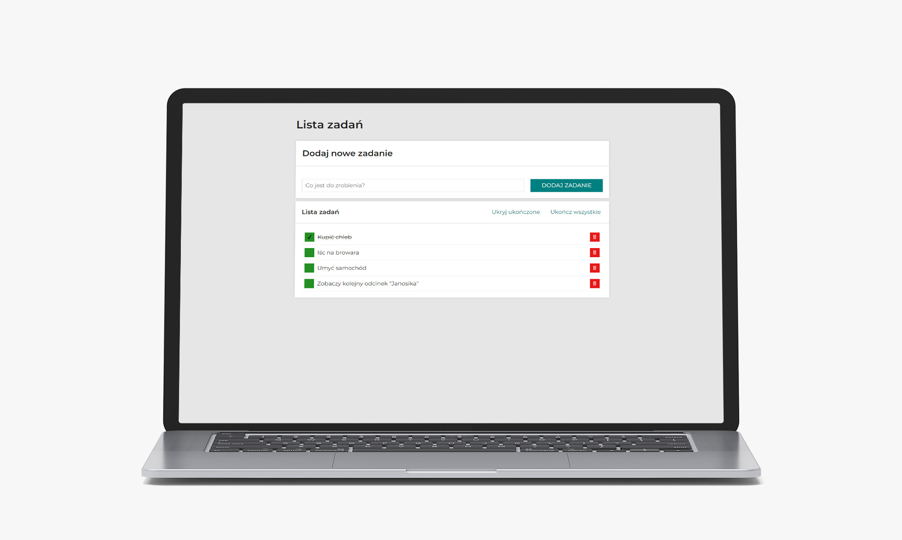

Oto zaktualizowany plik README.md, który uwzględnia wszystkie technologie, których użyłeś w projekcie:

markdown
Skopiuj kod
# Task List

This project is a fully interactive to-do list application that allows users to add, complete, and remove tasks. It showcases both functional and visual aspects, with persistent data storage.

## Technologies Used

- **HTML**
- **CSS** (replaced by `styled-components`)
- **BEM** – Methodology for class naming (used in initial versions)
- **JavaScript (ES6+)**
- **React** – Component-based UI library
- **JSX** – Syntax extension for JavaScript to write HTML in React
- **React Hooks** – For managing state and effects (`useState`, `useEffect`, `useRef`)
- **Custom React Hooks** – `useTasks` for task management and `useCurrentDate` for updating date and time
- **Styled Components** – Component-level styling with theme support, replacing traditional CSS
- **localStorage** – For persistent data storage of tasks
- **ThemeProvider** – Provides consistent theme-based styling across the application using a centralized theme

## Features

- **Add, complete, and remove tasks** with an interactive UI
- **Persistent task storage** using `localStorage`
- **Dynamic styling** with `styled-components` for modular and reusable styles
- **Theming** with `ThemeProvider` for consistent colors and styles across the app

This project is a complete example of a modern React application with modular, maintainable code and responsive design.

## Demo
[See the project](https://pawel-paluch.github.io/todo-list-react/)

# Getting Started with Create React App

This project was bootstrapped with [Create React App](https://github.com/facebook/create-react-app).

## Available Scripts

In the project directory, you can run:

### `npm start`

Runs the app in the development mode.\
Open [http://localhost:3000](http://localhost:3000) to view it in your browser.

The page will reload when you make changes.\
You may also see any lint errors in the console.

### `npm run build`

Builds the app for production to the `build` folder.\
It correctly bundles React in production mode and optimizes the build for the best performance.

The build is minified and the filenames include the hashes.\
Your app is ready to be deployed!

See the section about [deployment](https://facebook.github.io/create-react-app/docs/deployment) for more information.

### `npm run eject`

**Note: this is a one-way operation. Once you `eject`, you can't go back!**

If you aren't satisfied with the build tool and configuration choices, you can `eject` at any time. This command will remove the single build dependency from your project.

Instead, it will copy all the configuration files and the transitive dependencies (webpack, Babel, ESLint, etc) right into your project so you have full control over them. All of the commands except `eject` will still work, but they will point to the copied scripts so you can tweak them. At this point you're on your own.

You don't have to ever use `eject`. The curated feature set is suitable for small and middle deployments, and you shouldn't feel obligated to use this feature. However we understand that this tool wouldn't be useful if you couldn't customize it when you are ready for it.